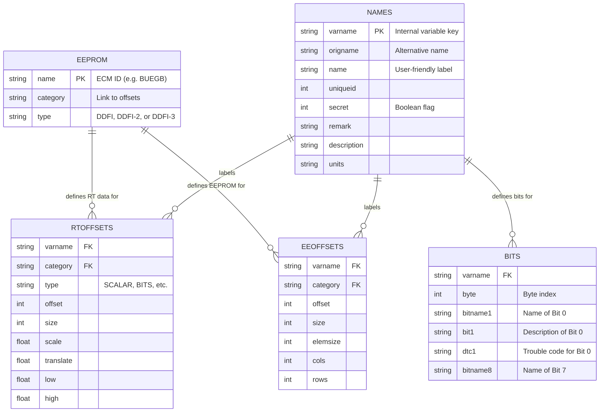

# Database Schema

The `ecmdroid.db` (found in `app/src/main/assets/ecmdroid.db.gz`) is a SQLite database that contains definitions for different ECM versions, including memory offsets and data translation parameters.

## Entity Relationship Diagram

## Tables Description

### 1. `eeprom`
This is the entry point for ECM identification. When the app connects to a motorcycle, it reads the ECM ID and looks it up in this table to determine which `category` of offsets to use.

### 2. `names`
A central repository for variable metadata. It decouples the internal variable keys (`varname`) from human-readable labels and descriptions.

### 3. `rtoffsets` (Real-Time Offsets)
Defines how to parse the live data stream sent by the ECM during runtime.
- **`offset`**: Position in the raw byte array.
- **`scale` / `translate`**: Parameters for the linear transformation `(raw * scale) + translate`.
- **`low` / `high`**: Recommended display ranges for gauges.

### 4. `eeoffsets` (EEPROM Offsets)
Defines the memory map for reading and writing to the ECM's permanent storage.
- **`cols` / `rows`**: Used for 2D tables (like Fuel Maps or Ignition Maps).
- **`elemsize`**: The size of a single element within an array or table.

### 5. `bits`
Used when a variable is of type `BITS` or `BITFIELD`. It maps individual bits within a byte to specific statuses or Diagnostic Trouble Codes (DTCs).
