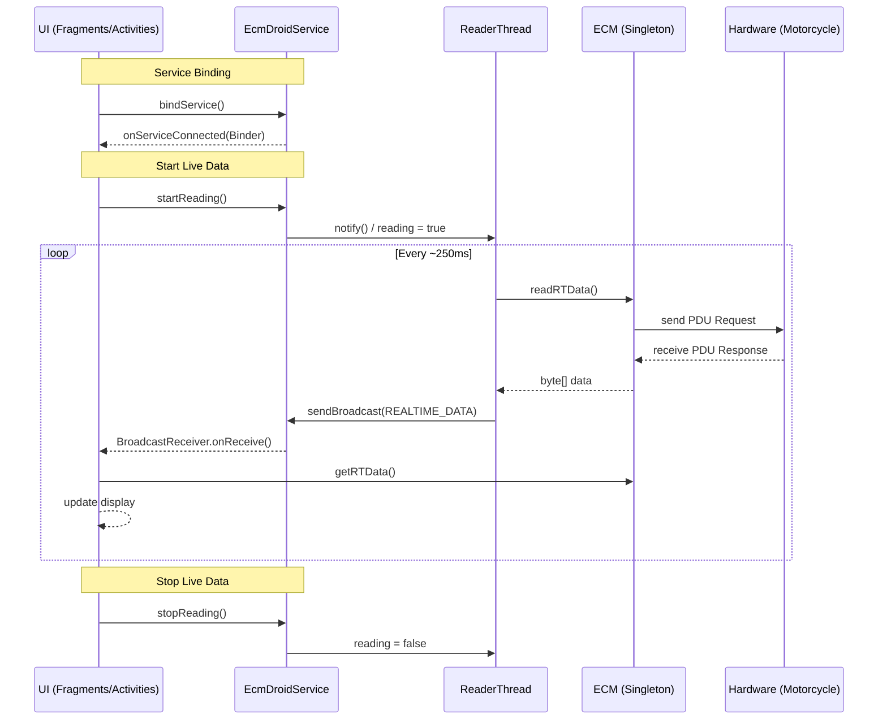
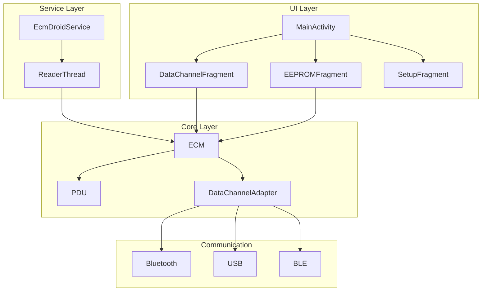

# Architecture Diagrams

## System Interaction Diagram

This diagram shows the relationship between the UI, the background service, and the core ECM logic.

```mermaid
sequenceDiagram
    participant UI as UI (Fragments/Activities)
    participant Svc as EcmDroidService
    participant Thread as ReaderThread
    participant ECM as ECM (Singleton)
    participant HW as Hardware (Motorcycle)

    Note over UI, Svc: Service Binding
    UI->>Svc: bindService()
    Svc-->>UI: onServiceConnected(Binder)

    Note over UI, Svc: Start Live Data
    UI->>Svc: startReading()
    Svc->>Thread: notify() / reading = true
    
    loop Every ~250ms
        Thread->>ECM: readRTData()
        ECM->>HW: send PDU Request
        HW-->>ECM: receive PDU Response
        ECM-->>Thread: byte[] data
        Thread->>Svc: sendBroadcast(REALTIME_DATA)
        Svc-->>UI: BroadcastReceiver.onReceive()
        UI->>ECM: getRTData()
        UI-->>UI: update display
    end

    Note over UI, Svc: Stop Live Data
    UI->>Svc: stopReading()
    Svc->>Thread: reading = false
```

## Component Diagram

```mermaid
graph TD
    subgraph UI Layer
        MainActivity --> DataChannelFragment
        MainActivity --> EEPROMFragment
        MainActivity --> SetupFragment
    end

    subgraph Service Layer
        EcmDroidService --> ReaderThread
    end

    subgraph Core Layer
        ReaderThread --> ECM
        DataChannelFragment --> ECM
        EEPROMFragment --> ECM
        ECM --> PDU
        ECM --> DataChannelAdapter
    end

    subgraph Communication
        DataChannelAdapter --> Bluetooth
        DataChannelAdapter --> USB
        DataChannelAdapter --> BLE
    end
```
